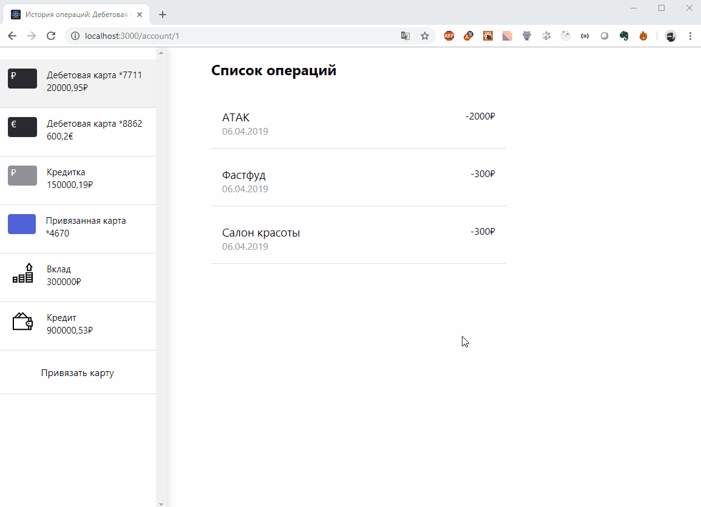
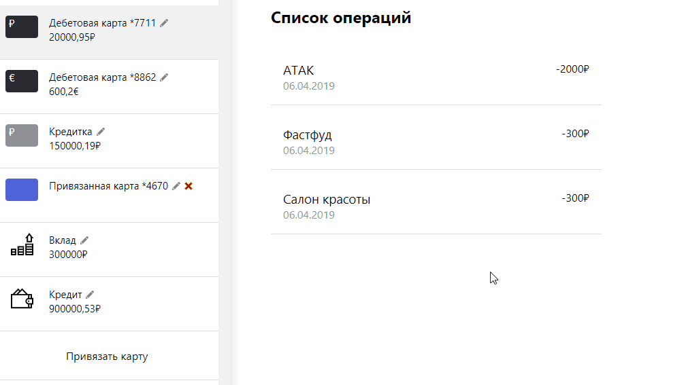

# Bank-accounts-manager
## TFS Frontend - React Homework

Репозиторий с домашними заданиями по курсу React.

Основан на [create-react-app](https://github.com/facebook/create-react-app).

Проект доступен по [ссылке](https://react-project-nilaev.vercel.app)

## FAQ

<details>
<summary>Как выполнять домашние задания?</summary>

* Клонируем репозиторий.
* Запускаем команду `yarn install`.
* Запускаем команду `yarn run test` и если видим "No tests found.." нажимаем на кнопку "A" на клавиатуре
* Видим упавшие тесты (не расстраиваемся).
* Начинаем реализовывать компоненты и добиваемся полного прохождения всех тестов.
* Все зеленое, а значит мы справились и мы молодец.
* Настраиваем репозиторий (нужно только один раз см. "Настройка CI").
* Пушим и отправляем на проверку.
</details>

<details>
<summary>Как запустить проект в браузере?</summary>

* Запускаем команду `yarn run start`.
* Открываем [http://localhost:3000](http://localhost:3000)
</details>

<details>
<summary>Настройка CI</summary>

Нам нужно настроить автоматический деплой сайта на хостинг для того, чтобы было удобно проводить ревью приложения.

1. Создаем аккаунт в сервисе vercel https://vercel.com/.
1. Привязываем в настройках https://vercel.com/account/login-connections свой Gitlab аккаунт
1. Заходим на страницу https://vercel.com/dashboard и нажимаем 'New project'
1. Выбираете 'Import git repository' -> Находите свой репозиторий с заданием -> Import
1. В настройках выбираете Framework preset = Create React App
</details>

<details>
<summary>ДЗ №1 "Первые шаги"</summary>

## ДЗ №1 "Первые шаги"

*Ориентировочное время выполнения 3 часа.*

Мы решили разработать свой интернет-банк. УРА!

Начнем с возможности просмотра списка банковских продуктов, которые есть у пользователя.

Продукты могут быть разными - это дебетовые и кредитные карты, вклады, кредиты, а также привязанные карты сторонних банков.

Вся информация о продукте содержится в объекте

```
{
    id: '1',
    name: 'Дебетовая карта',
    customName: 'Моя карта',
    type: 'debit' | 'credit' | 'saving' | 'loan',
    amount: '50000',
    currency: 'RUB | USD'
}
```

Баланс и валюту привязанных карт мы не знаем, поэтому с ними попроще
```
{
    id: '2',
    name: 'Карта ББТ',
    customName: 'Моя карта',
    type: 'external'
}
```

Для отображения информации о продукте уже реализован компонент `BoardItem`, но его нужно немного доработать. (см. BoardItem.test.js)

За отображение списка всех продуктов отвечает компонент `Board`, его нужно реализовать самостоятельно.

**Не забудь про сортировку :).**

Порядок следующий: дебетовые карты (debit) => кредитные (credit) => карты сторонних банков (external) => вклады (saving) => кредиты (loan).
Если есть несколько аккаунтов одного типа, то сортируем их по валюте RUB => USD => EUR => GBP

Тестов довольно много и они могут сбить столку. Поэтому рекомендую начать с реализации небольших компонентов `Button` и `Money`. Затем можно приступить к `BoardItem`, `Board` и `NewAccountForm`. Если все сделано правильно, то интеграционные тесты `App.test.js` пройдут тоже.


**Все стили уже реализованы, главное их правильно подключить.**


## Пример работы приложения


## Структура оценки

Максимум за работу можно получить 200 баллов.

* Компонент `BoardItem` - 60 баллов
* Форма привязки карт сторонних банков `NewAccountForm` - 60 баллов
* Компонент `Board` - 80 баллов

</details>

<details>
<summary>ДЗ №2 "Больше динамики"</summary>

## ДЗ №2 "Больше динамики"

*Ориентировочное время выполнения 4 часа.*

С первым MVP мы справились, что не может не радовать)
Давайте продолжим улучшать наш интернет-банк.

Много ли вы видели интернет-банков, да и вообще сайтов, с одной страницей?
Вот и я что-то припомнить не могу.

Нужно это дело исправить. Разработаем три странички: `AddNewCardPage`, `TimelinePage`, `NotFoundPage`.

**AddNewCardPage**

Данная страница должна отображаться при переходе на `/actions/add_card`.
На странице необходимо поместить форму привязки карты стороннего банка.

**TimelinePage**

Данная страница должна отображаться при переходе на `/account/:accountId`.
На странице будет список операций по аккаунту пользователя.

**NotFoundPage**

Данная страница должна отображаться, если пользователь перешел на страницу, которой нет на сайте.

**Маршрутизация**

Для настройки роутинга в приложени необходимо использовать библиотеку [react-router](https://reacttraining.com/react-router/web/guides/quick-start)


**Загрузка данных**

Все данные находятся в моках `mocks/accountsMock.json` и `mocks/operationsMock.json`.

Для загрузки данных нужно использовать функции `getAccounts` и `getOperations` из `services/requestMock.js`.

**Все стили уже реализованы, главное их правильно подключить.**

## Пример работы приложения



## Структура оценки

Максимум за работу можно получить 200 баллов.

* Перевод компонента App на асинхронную загрузку аккаунтов из `requestMock` - 30 баллов
* Доработка компонента Board - 30 баллов
* Разработка страницы NotFoundPage - 20 баллов
* Разработка страницы AddNewCardPage - 20 баллов
* Разработка страницы TimelinePage - 70 баллов
* Настройка роутинга в приложении (описать все Route`s) - 30 баллов
</details>

<details>
<summary>ДЗ №3 "Redux it"</summary>

## ДЗ №3 "Redux it"

За первые два задания мы сделали мини интернет-банк с несколькими страницами. На страницах можно посмотреть список операций по конкретному счету, или привязать карту стороннего банка.

Для хранения всех данных мы использовали локальный state компонентов. Данный подход имеет ряд недостатков:
* Неудобно передавать данные к удаленным компонентам
* Неудобно организовывать взаимодействие между компонентами
* Трудно отслеживать как компоненты взаимодействуют друг с другом

Давайте это исправим и перепишем наше приложение с использованием библиотеки Redux.

Для хранения состояния будем использовать глобальный store со следующей структурой state

```
{
    accounts: [], // массив аккаунтов пользователя
    operations: [] // список операций по аккаунту пользователя
}
```

В задании необходимо настроить store приложения (см. тест `store.test.js`).

Также необходимо описать основные `actions` и реализовать редюсер `redux/accounts/reducer.js` для работы с `accounts` (см. тест `reducer.test.js`)

Для `operations` необходимо описать основные `actions` и реализовать редюсер `redux/operations/reducer.js` (см. тест `reducer.test.js`)

Для асинхронных actions необходимо использовать `redux-thunk`.

## Дополнительное задание

Доработать интерфейс и реализовать возможность переименования аккаунтов пользователя (изменение customTitle). Также необходимо реализовать возможность удаления привязанных карт.



## Структура оценки

Максимум за работу можно получить 120 баллов.

* настройка store приложения - 20 баллов
* реализация actions и reducer для работы с accounts - 50 баллов
* реализация actions и reducer для работы с operations - 50 баллов
* реализация возможности переименования аккаунтов и удаления привязанных карт - просто respect :)
</details>

<details>
<summary>TypeScript (допзадание)</summary>

## TypeScript (допзадание)

В домашнем задании в качестве основного языка используется TypeScript. Использовать
его **не обязательно**.

Если вы решили **не** использовать TypeScript, на любую ошибку типизации ставьте
в качестве типа `any`.

Если вы решили использовать TypeScript, то:
* Типизируйте все компоненты, входящие в задание (props и state)
* Типизируйте все вспомогательные функции и компоненты, которые будете использовать
* Не должно быть ни одного `any` в проекте
</details>

